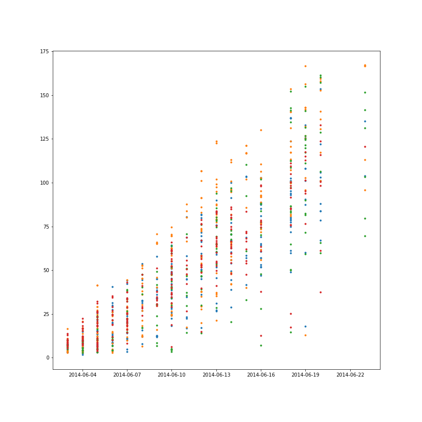
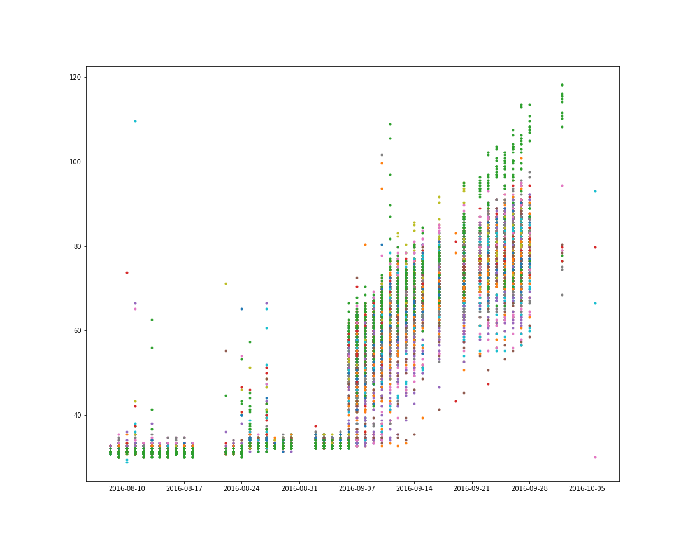
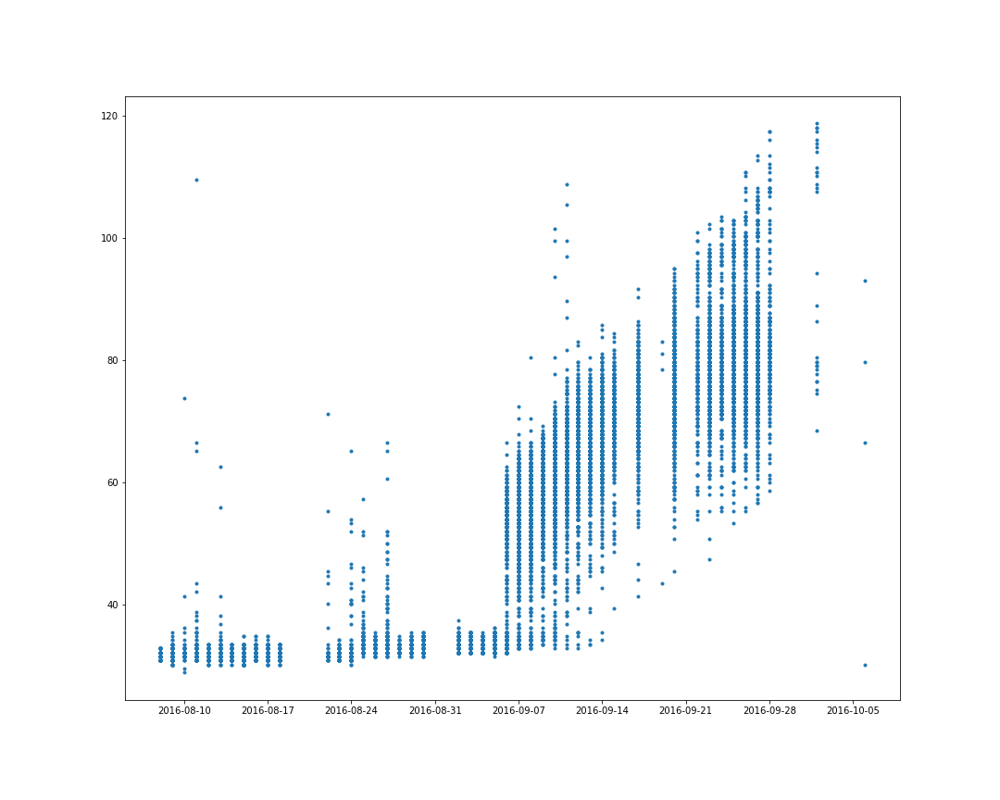
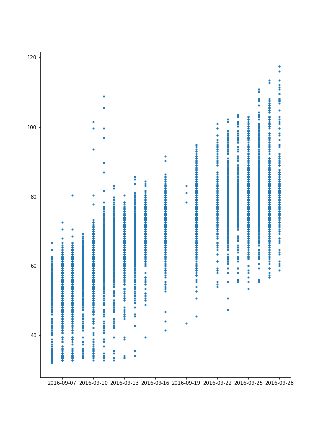
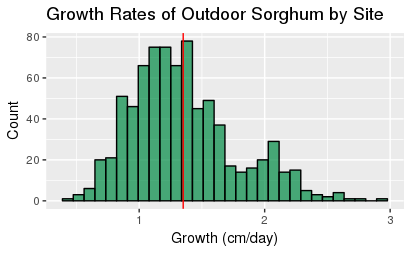
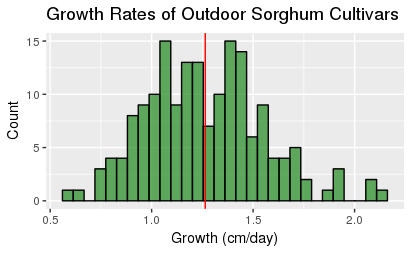

```{r setup, include=FALSE}
knitr::opts_chunk$set(echo = TRUE, message=FALSE)
```


## Background
Our original problem was to predict geometric properties of sorghum grown outdoors using the data from sorghum grown indoors. These properties included leaf length and width, leaf count, stem thickness, plant height, height, and canopy height, and the angle of leaf attachment.  

However, measurements were not available for all of the above traits. Additionally, none were measured both indoors and outdoors.

We decided to focus on heights, labeled as "plant height" for indoor plants and "height" for outdoor plants. Further, rather than try to work with raw heights across different stages of plant lives, we chose to compare the growth rates of indoor and outdoor plants.

We hoped to stratify data by cultivar, and measure the indoor and outdoor growth rate of each cultivar, but none of the cultivars were measured both indoors and outdoors. 

Ultimately, we decided to compare the growth rates of all cultivars of indoor plants to all cultivars of outdoor plants, and to compare the growth rates of all cultivars of indoor plants and all sites of outdoor plants.


## Description of Data
We considered plant height (mm), measured indoors, and height (cm), measured outdoors.

There were 22450 measurments outdoors from plants in 781 sites and 174 stated cultivars. The measurements were taken on 46 days from August 8th, 2016 to October 6, 2016. 

There were 915 plant measurements indoors from plants in 4 cultivars. All plants were considered to be at the same site. The measurements were taken on 18 days from June 3, 2016 to June 23, 2016. 

The indoor plants were grown in a greenhouse in St. Louis, Missouri, while the outdoor plants were grown outdoors in Mariscopa, Arizona. 


## Exploratory Data Analysis
Our initial analysis found an interval of time (prior to Sept. 6) for the outdoor data in which plant growths were near zero or negative. Outside of this time interval, the overall shape of data suggested linear-like growth.

Indoor plant data did not have a similar block of time with zero/negative growth, and it also exhibited a linear-like shape.

Next, we stratified indoor plant data by cultivar, and outdoor plant data by plot location and by cultivar.
### Indoor heights by cultivar:

### Outdoor heights by cultivar:


## Cleaning the Data
Since we were interested in the typical rate of growth of the plants, we decided to crop the data for the outdoor plants to the range in which theis growth seems most typical.
We truncated the outdoor heights and explored the data from Sept. 6 to Sept. 28 in order to compare similar stages of growth between the two locations. Analysis of weather data suggests that the initial period of zero/negative growth was abnormally hot.

For both sets of data, we removed any measurements missing dates, and removed measurements missing cultivar identifications as needed.





## Analysis
Outdoor growth rates, when stratified by site, were roughly normally distributed with a right skew, a mean of 1.35 and a standard deviation of 0.417.


Outdoor growth rates, stratified by cultivar, were bimodal with a mean of 1.26 and a standard deviation of 0.293.


## Discussion
The data clearly supports the conclusion that Sorghum grows more quickly in indoor conditions, which is not a surprise! 


