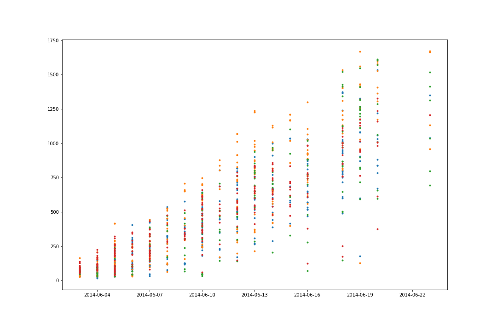

```{r setup, include=FALSE}
knitr::opts_chunk$set(echo = TRUE, message=FALSE)

library(dplyr)
library(readr)
library(ggplot2)
```

## Original problem goals


## Exploratory data analysis
### Plots




### Cleaning the outdoor height data


```{r, warning=FALSE}
bety_src <- src_postgres(dbname = "bety", 
                         password = 'bety', 
                         host = 'terra-bety.default', 
                         user = 'bety', 
                         port = 5432)

traits <- tbl(bety_src, 'traits')

variables <- tbl(bety_src, 'variables') %>%
  mutate(variable_id = id)

sites <- tbl(bety_src, 'sites') %>%
  mutate(site_id = id)

big_table <- traits %>%
  left_join(variables, by = 'variable_id') %>% 
  left_join(sites, by = 'site_id')
  


z<-big_table %>%
  filter(name == 'plant_height'&!is.null(date)) %>%
  collect %>% 
  select(site_id,cultivar_id, date, mean)

indoor_plot <- ggplot(data = z , aes(date, mean, group = site_id))+
  geom_point(size = 0.1, alpha = 0.2) +
  geom_smooth(method = "lm", se=FALSE, size = 0.1, alpha = 0.2) +
  facet_wrap(~cultivar_id, scales = 'free_x') +
  labs(y = "plant_height")

ggsave(filename="./indoor_plots/lm_by_cultivar.png", plot=indoor_plot)

```


```{r}

z<-big_table %>%
  filter(name == 'plant_height'&!is.null(date)) %>%
  collect %>% 
  select(site_id,cultivar_id, date, mean)

z$date <- sapply(z$date, as.Date)

reg <- lm(z$mean ~ z$date, data=z)
reg$coefficients[2]

# indoor in mm, outdoor in cm

```


```{r}

z<-big_table %>%
  filter(name == 'height'&!is.null(date)) %>%
  collect %>% 
  select(site_id,cultivar_id, date, mean)

# 

z <- z %>%
  filter(date > lubridate::ymd('2016-09-07')) %>%
  filter(date < lubridate::ymd('2016-10-01')) %>%
  collect(n=Inf)

outdoor_plot <- ggplot(data = z , aes(date, mean, group = site_id))+
  geom_point(size = 0.1, alpha = 0.2) +
  geom_smooth(method = "lm", se=FALSE, size = 0.1, alpha = 0.2) +
  labs(y = "height")

outdoor_plot

ggsave(filename="./indoor_plots/outdoor_lm_by_cultivar.png", plot=outdoor_plot)

# indoor in mm, outdoor in cm

z$date <- sapply(z$date, as.Date)

reg <- lm(z$mean ~ z$date, data=z)
summary(reg)
reg$coefficients[2]


```


```{r}


my_cultivars <- big_table %>%
  filter(name == 'plant_height') %>%
  select(cultivar_id) %>% 
  collect(n=Inf) %>% 
  distinct


my_cultivars <- my_cultivars$cultivar_id


my_cultivars[1] %in% my_cultivars

for(tname in c('height','plant_height') ){
  big_table %>%
    filter(name == tname, cultivar_id %in% my_cultivars) %>%
    select(name,date,mean,sitename,greenhouse,city,cultivar_id,site_id) %>% 
    collect(n = Inf) %>% 
    write_csv(path = paste0("~/Indoor-Outdoor/data/",tname,".csv"))
}


my_outdoor_data <- big_table %>%
  filter(name == 'height', cultivar_id %in% my_cultivars) %>%
  select(name,cultivar_id) %>% 
  collect(n=Inf)

my_outdoor_data


```


aa <- big_table %>%
  filter(name == 'height') %>%
  select(cultivar_id) %>% 
  collect(n=Inf) %>% 
  unique

aa


# download traits we want to /data/*.csv


big_table %>%
  filter(name == 'plant_height') %>%
  collect(n=Inf) %>%
  dim()


my_outdoor_data <- big_table %>%
  filter(name == 'height', cultivar_id %in% my_cultivars) %>%
  select(name,cultivar_id) %>% 
  collect(n=Inf)

my_outdoor_data


