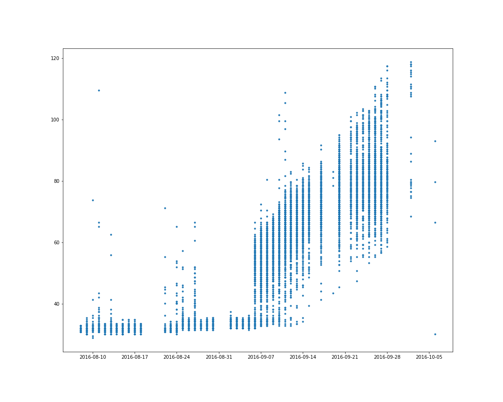

```{r setup, include=FALSE}
knitr::opts_chunk$set(echo = TRUE, message=FALSE)

library(dplyr)
library(readr)
library(ggplot2)
```


## Background
Our original problem was to predict geometric properties of Sorghum grown outdoors using the data from Sorghum grown indoors. 

The properties we wanted to predict include leaf length, leaf width, plant height, height, and canopy height.  

Not all of the properties we wanted to examine had been measured. Additionally, none of the properties besides height were measured both indoors and outdoors.

We decided to use the trait plant_height (measured indoors) to predict height (measured outdoors).

However, we didn't know how to use the indoor plant heights to actually predict outdoor heights. So we decided to compare the growth rates instead. 

We wanted to split our data up by cultivar, and measure the indoor and outdoor growth rate of each cultivar, but none of the four cultivars which were grown indoors were also grown outdoors. 

In the end, we decided to compare the growth rates of all the cultivars of indoor plants and all the cultivars of outdoor plants. We also decided to compare the growth rates of all the cultivars of indoor plants and all the sites of outdoor plants.


## Description of Data
We looked at plant height measured indoors, which was measured in mm, and height measured outdoors, which was measured in cm.

There were 22450 measurments outdoors from plants in 781 sites and 174 stated cultivars. The measurements were taken on 46 days from August 8th, 2016 to October 6,2016. We truncated the outdoor heights and explored the data from September 6,2016 to September 28,2016.

There were 915 plant measurements indoors from plants in 4 cultivars. All plants were considered to be at the same site. The measurements were taken on 18 days from June 3, 2016 to June 23,2016. 


The indoor plants were grown in a greenhouse in St. Louis, Missouri, while the outdoor plants were grown outdoors in Mariscopa, Arizona. 


## Exploratory Data Analysis

### Indoor heights by cultivar:
{ width=75% }

### Outdoor heights by cultivar:
{ width=75% }

## Cleaning the Data

{ width=75% }

{ width=75% }


## Analysis


## Discussion


